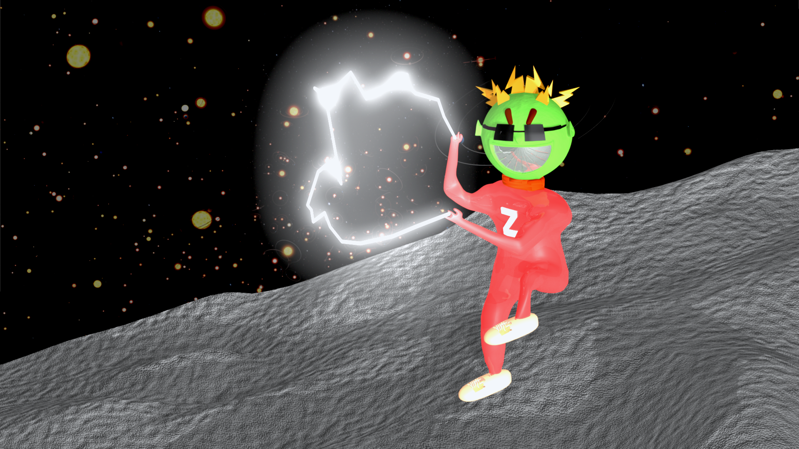
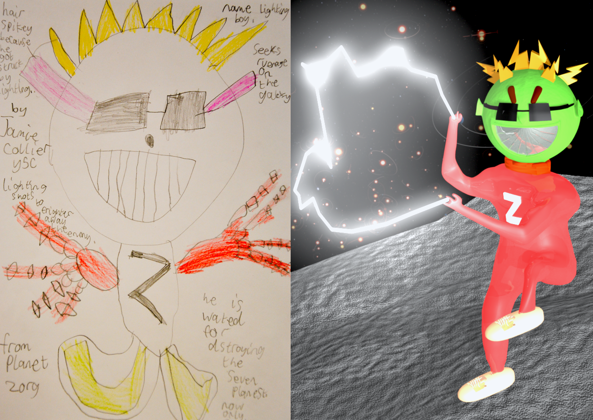

# Character Lightning Boy: 3D Render

A 3D model of a character called lightning boy using [Autodesk Maya](https://www.autodesk.co.uk/products/maya/overview).

Based on a childrens drawing, inspired by the [Monster Project](https://themonsterproject.org/).

Read more about how I created it, from [this detailed report](report.pdf).
